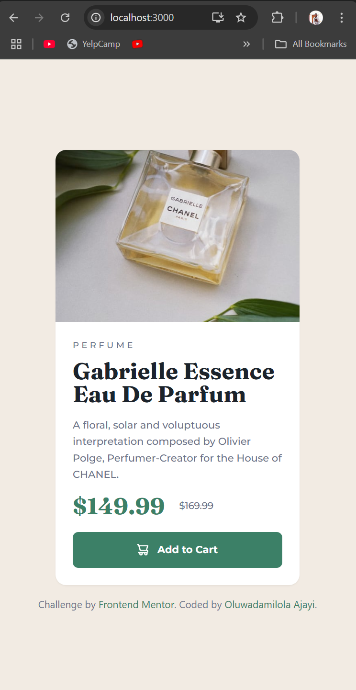
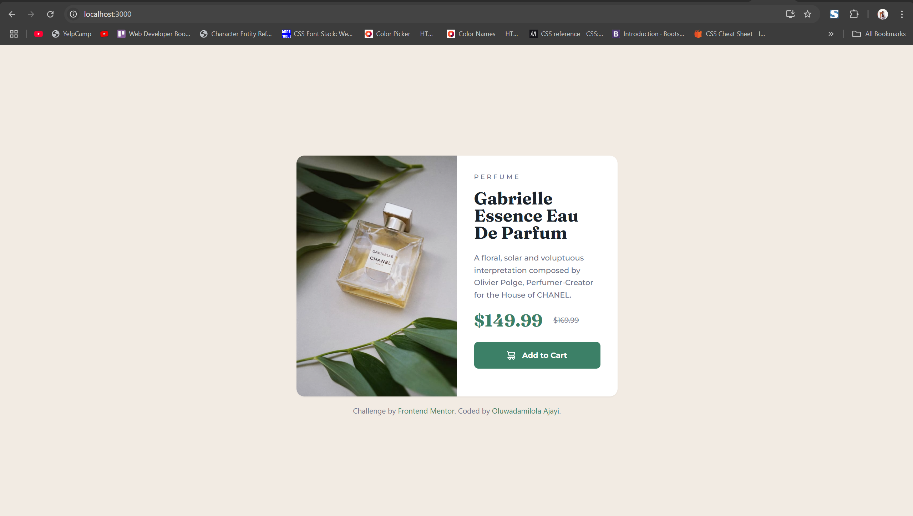

# Frontend Mentor - Product preview card component solution

This is my solution to the [Product preview card component challenge on Frontend Mentor](https://www.frontendmentor.io/challenges/product-preview-card-component-GO7UmttRfa). The challenge was to build a responsive product card that looks great on both mobile and desktop devices and includes accessible interactive elements.

## Table of contents

- [Frontend Mentor - Product preview card component solution](#frontend-mentor---product-preview-card-component-solution)
  - [Table of contents](#table-of-contents)
  - [Overview](#overview)
    - [The challenge](#the-challenge)
    - [Screenshot](#screenshot)
      - [📱 Mobile View](#-mobile-view)
      - [💻 Desktop View](#-desktop-view)
    - [Links](#links)
  - [My process](#my-process)
    - [Built with](#built-with)
    - [What I learned](#what-i-learned)
    - [Continued development](#continued-development)
    - [Useful resources](#useful-resources)
  - [Author](#author)
  - [Acknowledgments](#acknowledgments)

## Overview

### The challenge

Users should be able to:

- View the optimal layout depending on their device's screen size
- See hover and focus states for interactive elements
- Clearly distinguish between current and original prices
- Interact with a responsive and accessible call-to-action

### Screenshot

#### 📱 Mobile View  


#### 💻 Desktop View  


### Links

- [Live Site URL](https://hollywoodchallenge.onrender.com/)
- [Solution GitHub Repo](https://github.com/dodomiyake/hollywoodchallenge)

## My process

### Built with

- Semantic HTML5
- Tailwind CSS v4
- Mobile-first responsive layout
- React (Functional Components)
- Utility-first CSS design (Tailwind best practices)

### What I learned

This challenge helped me solidify my understanding of:

- Mobile-first design with Tailwind CSS
- Responsive layout using `md:` breakpoints
- Tailwind’s `object-cover`, `rounded-*`, and spacing utilities
- How to handle image rendering for different breakpoints
- Accessibility best practices: `hover`, `focus`, and `alt` attributes

Here’s a snippet I’m particularly proud of — it ensures the image fits for desktop and mobile:

```jsx
<figure className="h-[240px] md:h-auto md:w-1/2">
    
</figure>
```

### Continued development

In future projects, I plan to:

- Explore accessible animation and focus outlines
- Create a component system for scaling designs like this
- Use TypeScript for more type safety in components
- Build reusable design tokens into Tailwind’s config for even more consistency

### Useful resources

- [Tailwind CSS Docs](https://tailwindcss.com/docs)
- [Google Fonts](https://fonts.google.com)
- [Frontend Mentor community](https://www.frontendmentor.io)

## Author

- Website – [oluwadamilolaajayi.com](https://oluwadamilolaajayi.com)
- GitHub – [@dodomiyake](https://github.com/dodomiyake)
- Frontend Mentor – [@dodomiyake](https://www.frontendmentor.io/profile/dodomiyake)
- LinkedIn – [linkedin.com/in/oluwadamilolaxajayi](https://linkedin.com/in/oluwadamilolaxajayi)

## Acknowledgments

Special thanks to the **Frontend Mentor community** for the consistent challenges that push my skills, and to everyone who gave feedback during my learning journey.